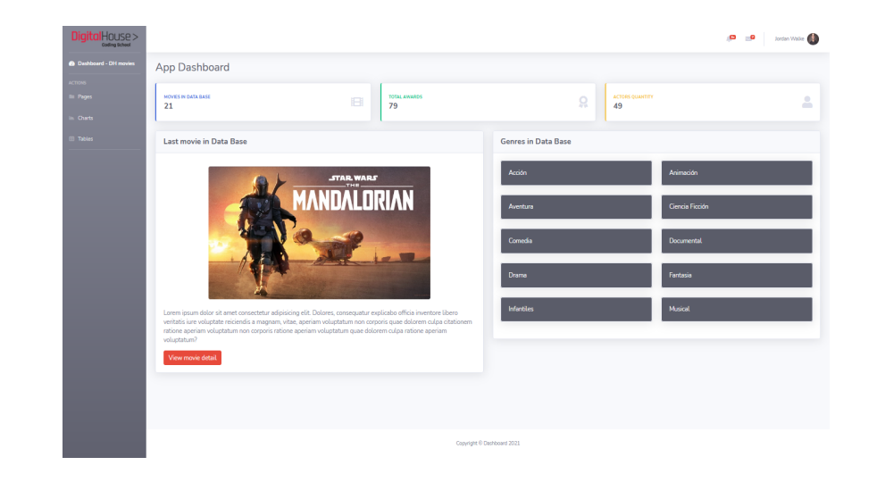
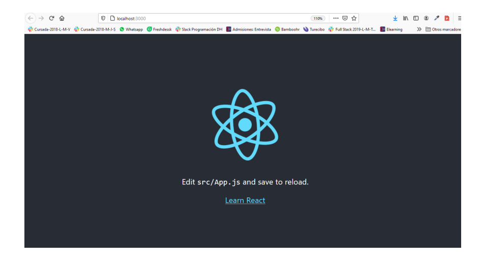
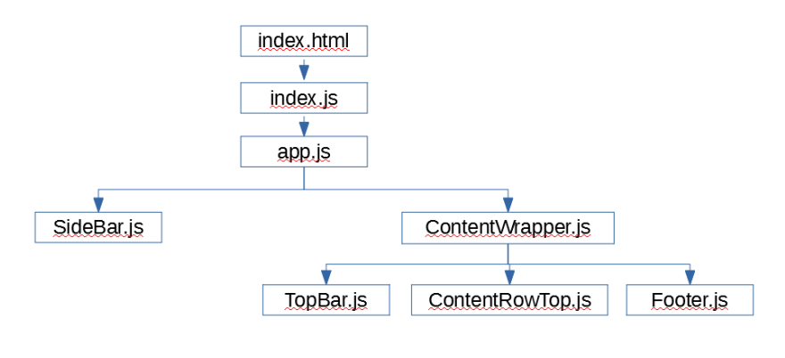
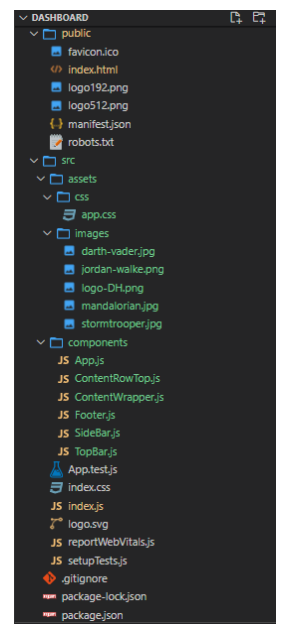

## Requisitos:
- Documento provisto: antes de iniciar revisemos en detalle el material provisto.
Una vez descargado, se ve así:

- HTML + CSS: estos skills ya hacen parte de nuestro set de herramientas, pero
proponemos que, antes de iniciar, nos familiaricemos con toda la estructura del
documento provisto para tener en claro por dónde ir.
- React Basics: para poder llevar a cabo esta misión es necesario tener en claro los
conceptos de “componente”. Si no es así, recomendamos tomarnos unos breves
minutos para repasar dichos conceptos.

## Micro desafío - Paso 1:
El objetivo principal será construir una app de React. Para ello podemos ejecutar alguno de
los siguientes comandos desde la consola:
- npx create-react-app my-app
- npm install -g create-react-app
- npm init react-app proyecto

Una vez esté la aplicación instalada, podemos ingresar a la carpeta creada proyecto y
ejecutar el comando: npm start, luego debemos ir al navegador y ejecutar:

Si todo está bien, lograremos ver algo así:

¡Atención! En esta ejercitación no trabajaremos con un entorno de Node.js ni Express,
ya que el enfoque principal de la misma es encararla 100% por el lado de React.

## Micro desafío - Paso 2:
Una vez esté la aplicación instalada, deberemos proceder a crear los componentes.
Tengamos en cuenta que los componentes que generemos deberán estar dentro la
carpeta /src y preferiblemente dentro de una carpeta llamada /components.

Por ello, antes de iniciar, debemos preguntarnos:

- ¿Qué partes de la interfaz pueden ser componentes?
- ¿Cuántos componentes se deben generar?
- Si un componente se parece mucho a otro, ¿hay alguna manera de hacer un solo
componente y definir su aspecto visual de alguna forma?

De todas maneras, entregamos una propuesta de referencia:

Adicionalmente, para tener una guía de la organización del proyecto, proporcionamos lo
siguiente:

Recordemos que para la creación de los componentes debemos pasar, del Documento
provisto, las porciones de códigos necesarias, así como el respectivo archivo css
(/src/assets/css/app.css) y las imágenes (/src/assets/images).

## Bonus Track:
Si logramos realizar toda la práctica, una buena idea es subdividir el componente creado:
/components/ContentRowTop.js en tres componentes independientes:

1. /components/ContentRowMovies.js
2. /components/LastMovieInDb.js
3. /components/GenresInDb.js

¡A usar la imaginación!

## Conclusión
Con esta práctica pudimos comprobar la versatilidad que nos ofrece React por medio de la
creación de los componentes. Estos son microentidades independientes y autosuficientes
que describen una parte de su interfaz de usuario. La IU de una aplicación se puede dividir
en componentes más pequeños, donde cada componente tiene su propio código,
estructura y API.

Facebook, por ejemplo, tiene miles de piezas de funcionalidad conectadas entre sí. Aquí
hay un dato interesante: Facebook comprende más de 30,000 componentes... y el número
sigue creciendo. La arquitectura de componentes le permite pensar en cada pieza de
forma aislada. Cada componente puede actualizar todo en su alcance, sin preocuparse por
cómo afecta a otros componentes.
¡Hasta la próxima!